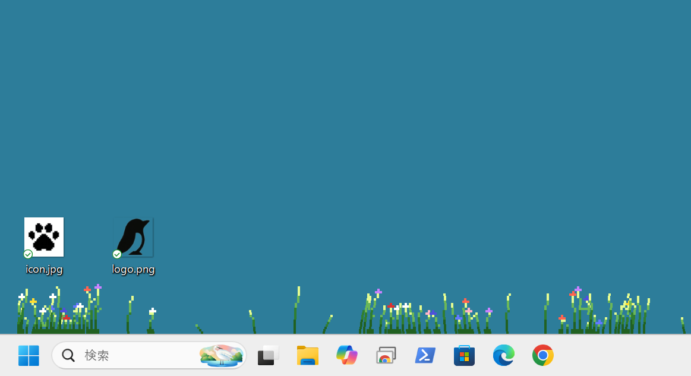

# 1/f Yuragi - ADHD Focus Support Overlay

**タスクバー（Windows）/ Dock（macOS）の上にドット絵の草を生やし、1/fゆらぎの風で揺らすデスクトップオーバーレイ**

[English](#english) | [日本語](#日本語)

---

## 日本語

### これは何？

ADHDなど多動傾向のある方の**集中支援**を目的としたデスクトップオーバーレイアプリです。

タスクバーのすぐ上にファミコン風のドット絵の草が生え、1/fゆらぎで自然に揺れます。風が左から右に波のように伝播し、まるで高原の草原のような動きを作り出します。

### なぜ草が揺れると集中できるのか？

- **確率共鳴（Stochastic Resonance）**: ADHDの脳は内部ノイズが低く、外部からの適度なノイズが信号処理を改善します（[Söderlund et al., 2007](https://acamh.onlinelibrary.wiley.com/doi/abs/10.1111/j.1469-7610.2007.01749.x)）
- **MBAモデル**: ホワイトノイズがADHD児の認知パフォーマンスを向上させることがメタ分析で確認されています（[Nigg et al., 2024](https://www.jaacap.org/article/S0890-8567(24)00074-1/abstract)）
- **視覚的環境ノイズ**: 聴覚ノイズの研究は豊富ですが、視覚的な環境ノイズによるADHD支援はまだ研究段階のフロンティアです

静かすぎると集中しにくい——かといってYouTubeを流すと引き込まれる。このアプリは**意味を持たない純粋な視覚的ゆらぎ**を提供することで、過集中のスイッチを入れるための環境を作ります。

### 特徴

- **1/fゆらぎ**: Voss-McCartney アルゴリズムによる自然な揺れ
- **風の波**: 左から右にさささ〜っと伝播する風。突風もあり
- **完全クリック透過**: マウス操作に一切干渉しない
- **マウス近接透過**: マウスが近づくと草がフェードアウト
- **プロシージャル生成**: 草の形状・配置を自動生成。気に入ったら保存
- **3タイプの草**: しゅっとした細い草 / 葉付き草 / 花付き草
- **8色パレット**: フォレスト、エメラルド、オータム、オーシャン、サクラ、ラベンダー、サンセット、モス
- **詳細な設定UI**: 長さ、密集度、まばら具合、風の強さ、色、マウス透過をすべてスライダーで調整
- **設定の分離保存**: 草プリセット（配置）と環境設定（風・マウス）を別々に保存/読み込み
- **表示切替**: Win+Ctrl+Shift+W（Windows）/ Cmd+Ctrl+Shift+W（macOS）でON/OFF

### ダウンロード

[Releases](https://github.com/me-keh-dev/1f/releases) からダウンロードしてください。

**Windows:**
1. `1f.exe` をダウンロード
2. 好きな場所に置く（例: デスクトップ、`C:\Tools\1f\` など）
3. ダブルクリックで起動

**macOS:**
1. `1f-macos` をダウンロード（GitHub Actions経由で提供予定）
2. 好きな場所に置く
3. ターミナルで `chmod +x 1f-macos && ./1f-macos` で起動

インストール作業は不要です。ダウンロードしたファイルをそのまま開けば使えます。
設定ファイルや保存データは実行ファイルと同じフォルダに自動で作られます。

### 開発者向け（ソースから実行）

```bash
# Python 3.9以上が必要です
pip install -r requirements.txt

# macOSの場合は追加で:
# pip install pyobjc-core pyobjc-framework-Cocoa

python main.py
```

### 使い方

起動するとタスクバー（Windows）/ Dock（macOS）の上に草が生えます。

- **Win+Ctrl+Shift+W**（Windows）/ **Cmd+Ctrl+Shift+W**（macOS）: 表示/非表示の切り替え
- **設定画面**: システムトレイ / メニューバーの緑のアイコンを右クリック → 「設定」
- **再生成**: 右クリック → 「再生成」で新しい草原を生成
- **終了**: 右クリック → 「終了」

### 設定項目

| カテゴリ | 設定 | 説明 |
|---|---|---|
| 草の長さ | 最小 / 最大 | 草の高さの範囲（ピクセル単位） |
| 密集エリア | 塊の数 | クラスターが何箇所あるか |
| | 総本数 | 茂みに使う草の総数 |
| | 密集度 | 各塊の詰まり具合 |
| | 間隔 | 塊どうしの距離 |
| 散在エリア | 本数 | まばらに生える草の本数 |
| | 密度 | 散在する草の間隔 |
| 草のタイプ | 細い草 / 花 | しゅっとした草と花の比率（残りが葉付き草） |
| 風 | 風の強さ | 穏やか〜強風。突風の強さにも影響 |
| マウス透過 | ON/OFF | マウス近接時の透過機能 |
| | 中心 / 範囲 / 透過度 | 透過のパラメータ |

### スクリーンショット



### 動作環境

- Windows 10 / 11
- macOS 12+

### 学術的背景

このアプリのコンセプトは以下の研究に基づいています：

- Söderlund, G., Sikström, S., & Smart, A. (2007). *Listen to the noise: Noise is beneficial for cognitive performance in ADHD.* Journal of Child Psychology and Psychiatry, 48(8), 840-847.
- Nigg, J.T., et al. (2024). *Systematic Review and Meta-Analysis: Do White Noise or Pink Noise Help With Task Performance in Youth With ADHD?* Journal of the American Academy of Child & Adolescent Psychiatry.
- Rijmen, J., Senoussi, M., & Wiersema, J.R. (2026). *Pink Noise and a Pure Tone Both Reduce 1/f Neural Noise in Adults With Elevated ADHD Traits.* Journal of Attention Disorders.

---

## English

### What is this?

A desktop overlay app for **ADHD focus support** on Windows and macOS.

Pixel-art grass grows above the taskbar (Windows) or Dock (macOS) and sways with 1/f fluctuation. Wind waves propagate from left to right, creating a natural meadow-like animation.

### Why does swaying grass help focus?

Research shows that moderate external noise improves cognitive performance in individuals with ADHD through **stochastic resonance** — a phenomenon where random noise boosts weak neural signals past the detection threshold. While auditory noise has been extensively studied, **visual ambient noise** for ADHD support is a novel frontier.

This app provides **meaningless visual fluctuation** — not distracting content like videos, but pure motion that keeps the brain at optimal arousal for sustained focus.

### Features

- **1/f noise**: Natural sway using Voss-McCartney algorithm
- **Wind waves**: Left-to-right propagating gusts with occasional strong bursts
- **Full click-through**: Zero interference with mouse input
- **Mouse proximity fade**: Grass becomes transparent near the cursor
- **Procedural generation**: Auto-generated grass shapes, save your favorites
- **3 grass types**: Slim / Leafy / Flowering
- **8 color palettes**: Forest, Emerald, Autumn, Ocean, Sakura, Lavender, Sunset, Moss
- **Detailed settings UI**: Length, density, sparseness, wind, colors, mouse fade
- **Separate save slots**: Grass presets (layout) and environment settings (wind/mouse) saved independently
- **Toggle hotkey**: Win+Ctrl+Shift+W (Windows) / Cmd+Ctrl+Shift+W (macOS)

### Download

Download from [Releases](https://github.com/me-keh-dev/1f/releases).

**Windows:** Download `1f.exe`, place it anywhere, double-click to run.

**macOS:** Download `1f-macos`, place it anywhere, run `chmod +x 1f-macos && ./1f-macos` in Terminal.

No installation required. Just open the downloaded file and it works.
Settings and save data are automatically stored in the same folder as the executable.

### For Developers (run from source)

```bash
# Requires Python 3.9+
pip install -r requirements.txt

# macOS additionally requires:
# pip install pyobjc-core pyobjc-framework-Cocoa

python main.py
```

### Usage

Grass will appear above the taskbar (Windows) / Dock (macOS) on launch.

- **Win+Ctrl+Shift+W** (Windows) / **Cmd+Ctrl+Shift+W** (macOS): Toggle visibility
- **Settings**: Right-click the tray / menu bar icon → "設定" (Settings)
- **Regenerate**: Right-click → "再生成" (Regenerate)
- **Quit**: Right-click → "終了" (Quit)

### System Requirements

- Windows 10 / 11
- macOS 12+

### Academic Background

- Söderlund et al. (2007) — *Listen to the noise: Noise is beneficial for cognitive performance in ADHD*
- Nigg et al. (2024) — *Systematic Review and Meta-Analysis: Do White/Pink Noise Help With Task Performance in Youth With ADHD?*
- Rijmen et al. (2026) — *Pink Noise and a Pure Tone Both Reduce 1/f Neural Noise in Adults With Elevated ADHD Traits*

### License

[MIT License](LICENSE)

### Contributing

Contributions are welcome! Please see [CONTRIBUTING.md](CONTRIBUTING.md).
